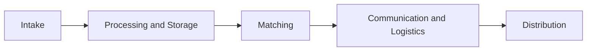

# adoptafamily
Adopt A Family BuildWithChrist Event

## Overview
The Adopt A Family event is a collaborative effort to streamline and automate the process of matching families in need with sponsors during the holiday season. This initiative aims to reduce the manual workload for organizers and improve the efficiency of the adoption process.

## Process Flow

### Current Process
The current process involves several manual steps:

1. **Intake**: Families in need are interviewed to collect their wish lists and demographic information. This is done in person to ensure detailed and accurate information.
2. **Processing and Storage**: The collected information is manually entered into spreadsheets and stored in Google Drive. Each family's wish list is saved as an individual Word document.
3. **Matching**: Families are matched with sponsors based on their preferences and the sponsors' capabilities. This involves a lot of manual coordination and communication.
4. **Communication and Logistics**: Sponsors are sent standardized emails with the wish lists and other relevant information. This step is labor-intensive and involves a lot of copy-pasting and attaching files.
5. **Distribution**: Finally, the gifts are distributed to the families.

### Proposed Process Flow

### Detailed Process Flow

```mermaid
graph LR
    A[Intake - Christie/Catholic Charities] -->|Collect wish lists and demographic information| B[Processing and Storage - Christie/Catholic Charities]
    B -->|Enter data into spreadsheets and save individual wish lists| C[Matching - Gene/Isabel/Adopt A Family]
    C -->|Match families with sponsors| D[Communication and Logistics - Gene/Isabel/Adopt A Family]
    D -->|Send standardized emails with wish lists| E[Distribution - Gene/Isabel/Adopt A Family]
    E -->|Distribute gifts to families| F[End]
```

## Event Details

### BuildWithChrist.ai
BuildWithChrist.ai is an initiative to learn AI by serving others. The Adopt A Family event is one of the projects under this initiative. The goal is to use AI and automation to streamline processes and make a positive impact on the community.

### Event Goals
- **Entertain and Educate**: Showcase the capabilities of AI and automation in solving real-world problems.
- **Collaborate**: Work together as a team to achieve a common goal.
- **Deliver Impactful Solutions**: Provide tools and solutions that can significantly reduce the manual workload for organizers.

### Event Structure
- **Orientation Calls**: Initial calls to orient participants to the event and the organization.
- **Solution Planning**: Coordination calls to plan and refine solutions.
- **Final Check-in**: A final call to ensure everything is on track.

### Event Timeline
- **Orientation Calls**: Initial calls to orient participants.
- **Solution Planning**: Coordination calls to plan and refine solutions.
- **Final Check-in**: A final call to ensure everything is on track.

## How to Contribute

### Getting Started
1. **Join the Orientation Calls**: Participate in the orientation calls to understand the process and the goals.
2. **Review the Materials**: Go through the materials provided in the dashboard and task list.
3. **Choose a Track**: Select a track that aligns with your skills and interests.
4. **Collaborate**: Work with your team to develop solutions.
5. **Test and Refine**: Test your solutions and refine them based on feedback.

### Tracks
- **Product Development**: Focus on building the core product.
- **Marketing**: Handle the marketing aspects, such as creating landing pages and promotional materials.
- **Analytics and Dashboard**: Develop analytics and dashboard solutions.
- **Automation**: Work on automating various parts of the process.
- **Translation**: Focus on translating information and communication.
- **Matching Algorithm**: Develop algorithms to match families with sponsors.

### Tools and Technologies
- **AI and Automation Tools**: Use AI tools to automate processes and improve efficiency.
- **Spreadsheets and Databases**: Utilize spreadsheets and databases to manage and store information.
- **Email Automation**: Implement email automation to streamline communication.
- **Translation Tools**: Use translation tools to bridge language barriers.

## Contact Information

For any questions or additional information, please contact:
- **Michael Lyons**: [michael.lyons@example.com](mailto:michael.lyons@example.com)
- **Christie Crane**: [christie.crane@example.com](mailto:christie.crane@example.com)
- **Gene Rice**: [gene.rice@example.com](mailto:gene.rice@example.com)

## License

This project is licensed under the MIT License. See the [LICENSE](LICENSE) file for details.
